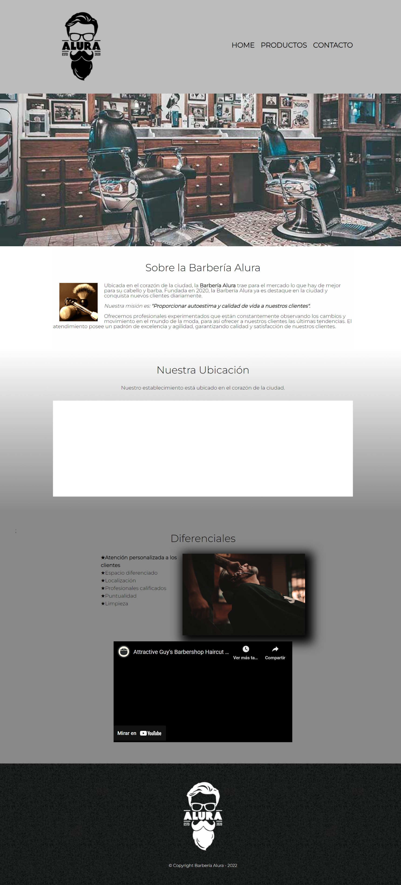
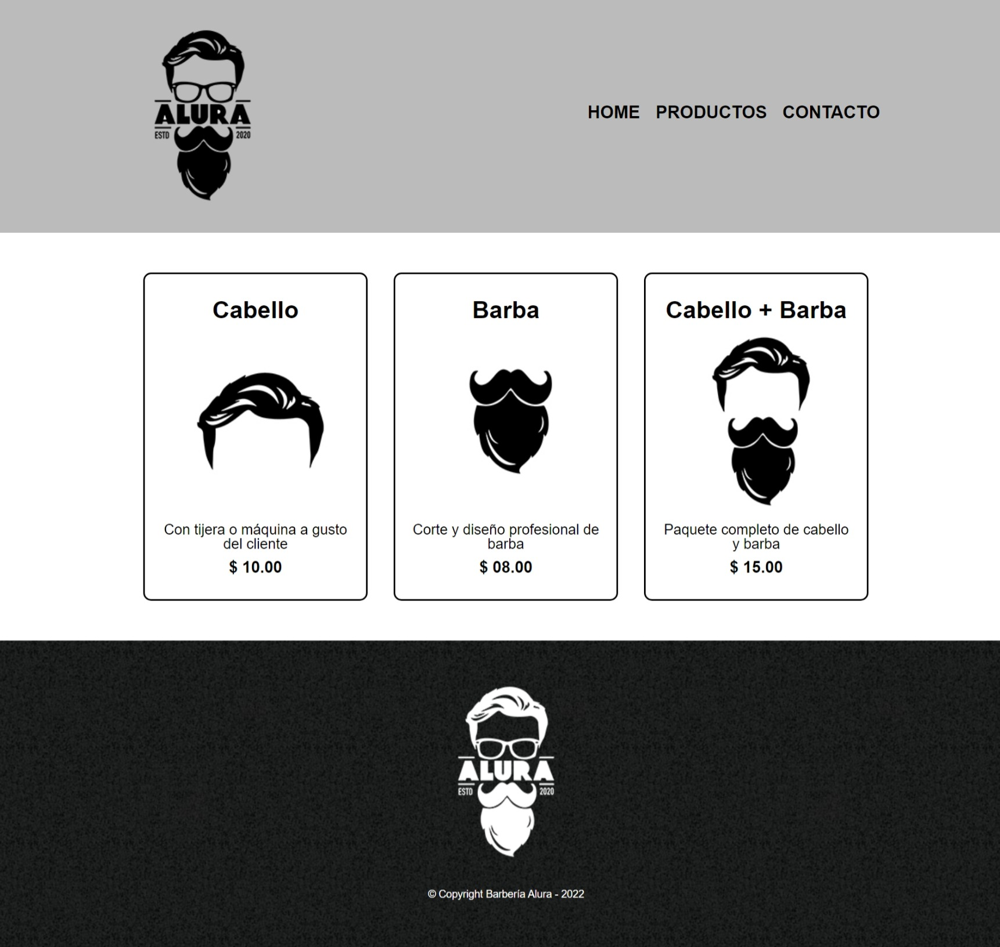
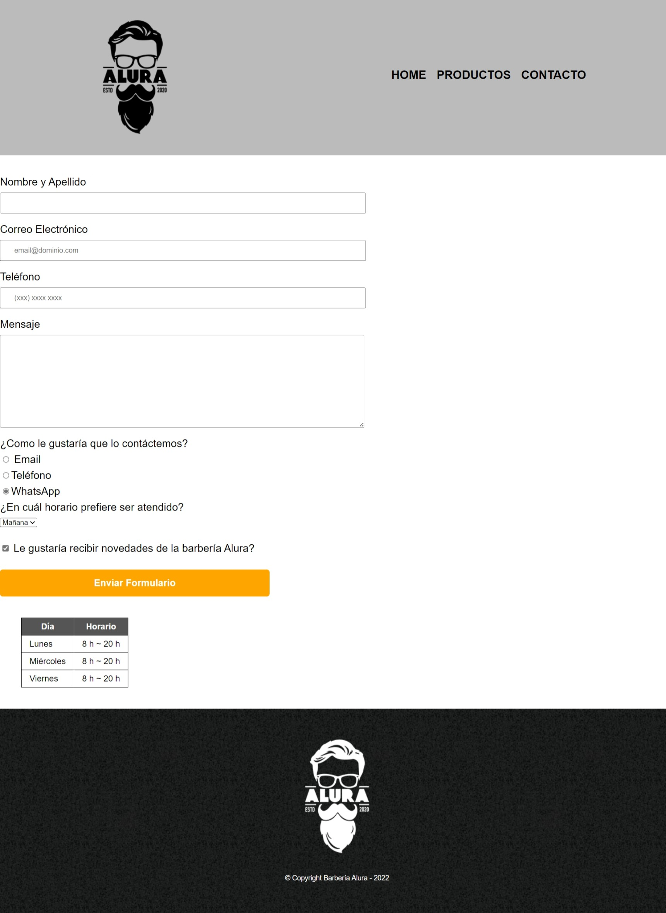

# Barbería Alura





## Descripción

Barbería Alura es un proyecto de sitio web diseñado para una barbería ficticia llamada "Alura". Este proyecto fue desarrollado como parte del curso de Front-end de Alura y tiene como objetivo mostrar habilidades en HTML, CSS y JavaScript.

## Instalación

1. Clona el repositorio:

   ```bash
   git clone https://github.com/lcastillo24/Barberia-Alura.git
Abre el archivo index.html en tu navegador web.
Características
Diseño moderno y atractivo para una barbería.
Página principal con información sobre la barbería, servicios ofrecidos y testimonios de clientes.
Páginas adicionales para mostrar detalles de los servicios, galería de imágenes y formulario de contacto.
Totalmente responsivo, funciona bien en dispositivos móviles y de escritorio.
Capturas de Pantalla
Inserta aquí capturas de pantalla del proyecto si las tienes.

## Tecnologías Utilizadas
HTML
CSS
JavaScript
## Contribución
Si deseas contribuir a este proyecto, sigue estos pasos:

Haz un fork del repositorio.
Crea una nueva rama (git checkout -b feature/nueva-caracteristica).
Haz tus cambios y realiza un commit (git commit -am 'Agregar nueva característica').
Sube tus cambios a la rama (git push origin feature/nueva-caracteristica).
Crea un nuevo Pull Request.

## Autor
Laura Castillo - GitHub
## Licencia
Este proyecto está bajo la Licencia MIT. Para más detalles, consulta el archivo LICENSE.
